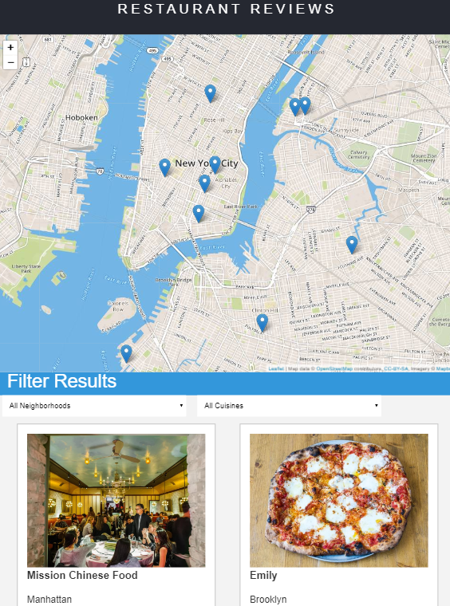
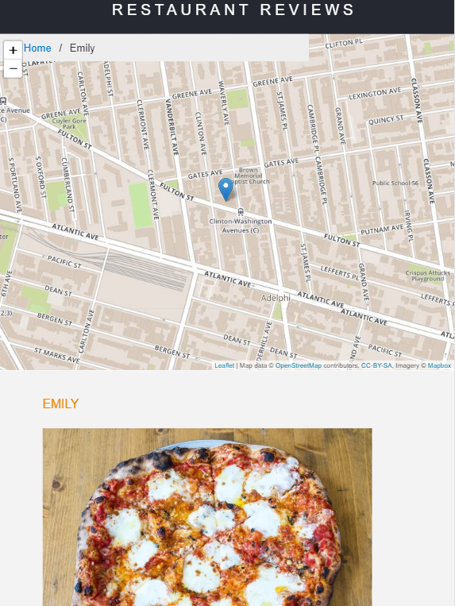
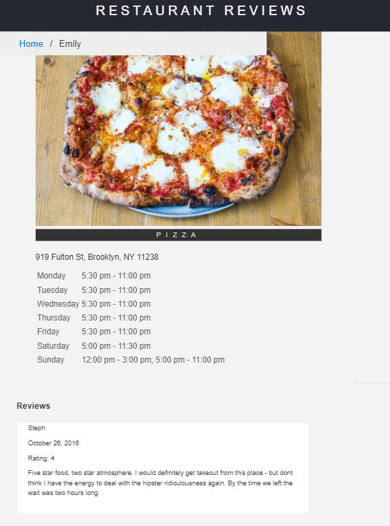

# Responsive, accessible offline-ready restaurant app

This is based on a udacity project assignment: https://github.com/udacity/mws-restaurant-stage-1

For the  Udacity **Restaurant Reviews** projects, this is a static webpage that has been converted to a mobile-ready web application. Added accessibility and converted the design to be responsive on different sized displays and accessible for screen reader use. Also added a service worker to allow offline use.

### Getting Started

setup description taken from here: https://github.com/udacity/mws-restaurant-stage-1

Clone the project, then...

1. In this folder, start up a simple HTTP server to serve up the site files on your local computer. Python has some simple tools to do this, and you don't even need to know Python. For most people, it's already installed on your computer. 

In a terminal, check the version of Python you have: `python -V`. If you have Python 2.x, spin up the server with `python -m SimpleHTTPServer 8000` (or some other port, if port 8000 is already in use.) For Python 3.x, you can use `python -m http.server 8000` or `python3 -m http.server 8000`. If you don't have Python installed, navigate to Python's [website](https://www.python.org/) to download and install the software.

2. With your server running, visit the site: `http://localhost:8000`, and look around for a bit!

## Authors

* **Adam Razzak** 

## Acknowledgements

* readme template: https://gist.github.com/PurpleBooth/109311bb0361f32d87a2
* Udacity course and people! see https://eu.udacity.com/course/front-end-web-developer-nanodegree--nd001

## project preview:

app screens:

